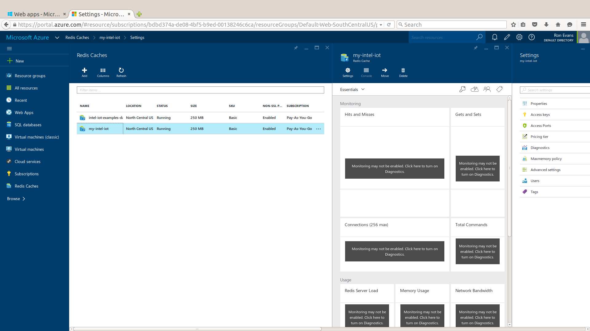
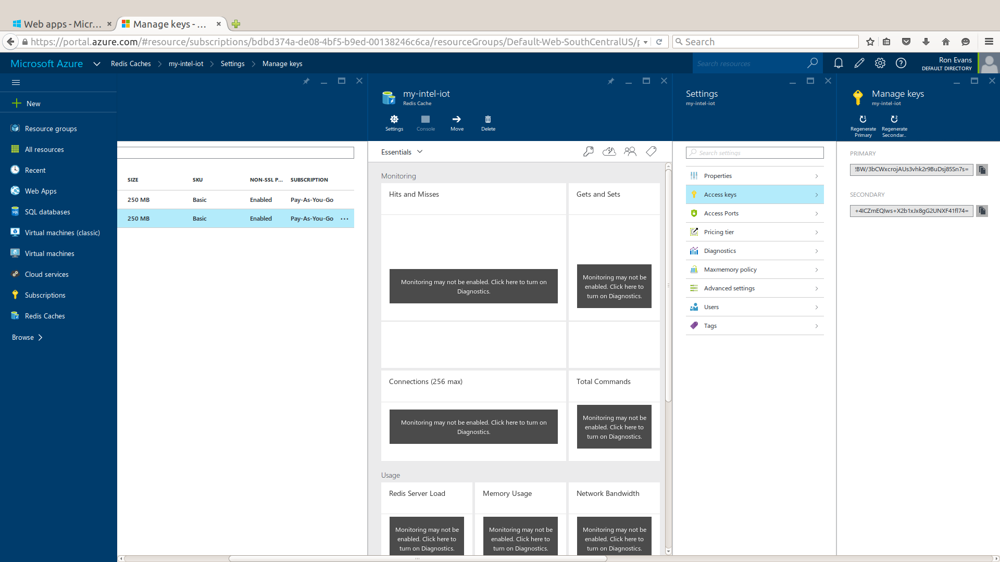
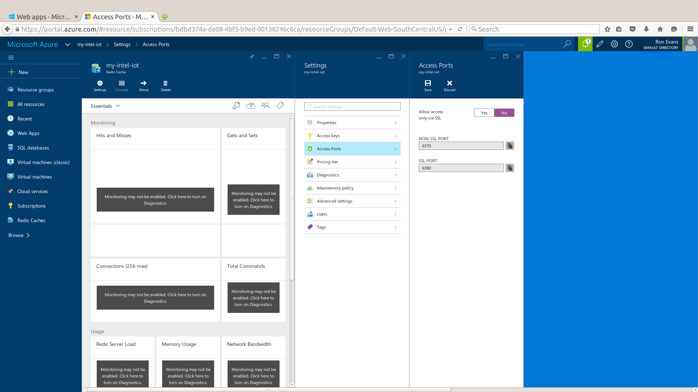
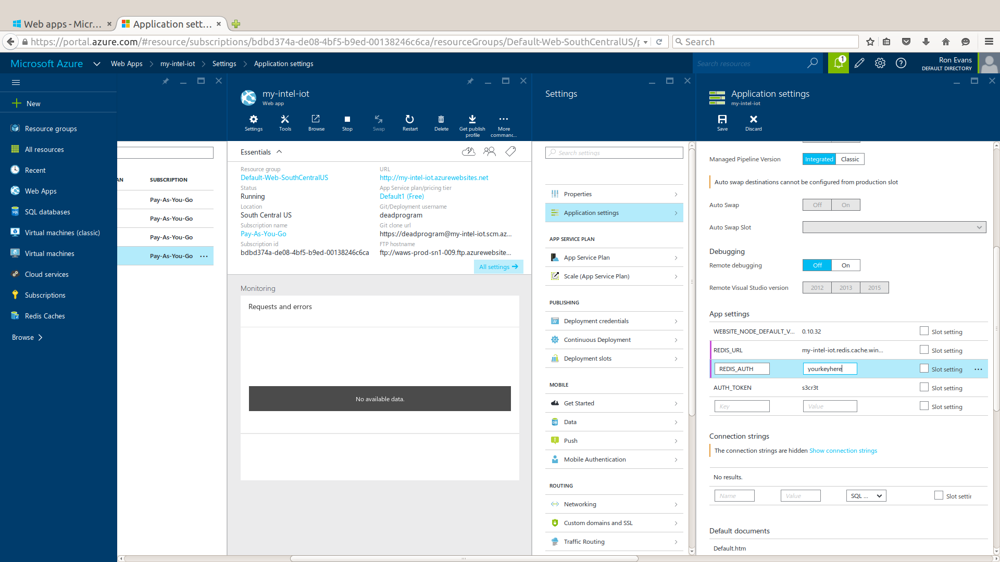

# Intel IoT Examples Datastore

The Intel IoT Examples Datastore is intended to provide a simple data store for example applications that are part of the Intel IoT Starter Kits examples.

It is a Node.js application written using [Express][]. It uses a [Redis][] data store.

Although this data storage app was initially developed to deploy on Microsoft Azure, since it is based on commonly used open source modules, it should be easy to deploy on many different cloud hosts.

[Express]: https://github.com/strongloop/express
[Redis]: http://redis.io/

## How It Works

The Intel IoT Examples Datastore application provides a simple REST API that allows authorized callers to store either log data, or incremental counter data.

It exposes two sets of routes, both using basic token authentication.

To authorize, provide the AUTH_TOKEN you set in the `X-Auth-Token` HTTP header.

Multiple clients can share the same Intel IoT Examples Datastore, by simply using a different route "key" for each application.

### Counter

The counter routes are used to increment an increasing counter.

- **GET /counter/:key** - gets the current value of a counter
- **GET /counter/:key/inc** - increments a counter by 1

### Logger

The logger routes wrap Redis lists, and are used to keep a linear backlog of values.

- **GET /logger/:key** - gets the latest value of a log
- **PUT /logger/:key** - adds a value to a log (`value` param in POST body)
- **GET /logger/:key/all** - returns all values of a log

## Local Setup

To install the app's dependencies, use NPM:

    $ npm install

You'll also need to have Redis installed.
For more info on that, see the [Redis download page](http://redis.io/download).

## Configuration

The primary configuration for the application takes the form of the following ENV vars:

- **REDIS_URL** - the URL to use for Redis communication
- **REDIS_AUTH** - authentication token for Redis backend
- **PORT** - port to serve app on (defaults to `3000`)
- **AUTH_TOKEN** - authentication token for clients to use

## Deployment  - Microsoft Azure

This guide will cover setting up a deployment environment for the Datastore on Microsoft Azure.

For other platforms, please refer to the platform documentation.

Before we begin, please ensure you have an [Azure account](https://portal.azure.com/signin/index).

### Create New Web App

Click on "New", then choose "Web + Mobile", then click "Web App".

Enter the name for your new web application.

Click on the "Create" button. Your new web application will be created.

### Create New Redis Cache

Click on "New", then choose "Data + Storage", then click "Redis Cache".

Enter the name for your new Redis cache.

Click on the "Create" button. Your new Redis cache will be created.

### Determine Settings For Redis

Click on the "Redis Caches" in the left sidebar, then click on the name of the new Redis cache you created in the previous step.

Click on "Settings" then click on "Properties". Write down or copy the "Host Name" field so you can use that value for the `REDIS_URL` setting for the web application.

Click on "Settings" then click on "Access Keys". Write down or copy the "Primary" or "Secondary" field so you can use that value for the `REDIS_AUTH` setting for the web application.

Click on "Settings" then click on "Access Ports". Click on the "Allow access only via SSL" to set it to "No". Click on the "Save" button.

### Configure Web App

Click on the "Web Apps" in the left sidebar, then click on the name of the new web application you created in the first step.

Click on "Settings" then click on "Application Settings". Scroll down to the "App Settings" section.

Enter `REDIS_URL` into the first blank "Key" field. Enter the value from "Host Name" from above in the the "Value" field.

Enter `REDIS_AUTH` into the next blank "Key" field. Enter the value from "Primary" from above into the "Value" field.

Enter `AUTH_TOKEN` into the next blank "Key" field. Enter whatever shared secret key that you want into the "Value" field.

Click on the "Save" button.

Note that you don't need to set `PORT`, as the Microsoft Azure platform will do that automatically.

### Deploy Web App

Click on the "Web Apps" in the left sidebar, then click on the name of the new web application you created in the first step.

Click on "Settings" then click on "Continuous Deployment". Click on "Choose Source", then click on "Local Git Repository". Click on the "Save" button.

Click on "Settings" then click on "Deployment Credentials". Enter a new "FTP/deployment user name" and "Password", then click on "Save".

Click on "Settings" then click on "Properties". Scroll down to display the field "Git URL". Copy the contents of the field.

Now, bring up the command line in the directory you use for this repo. Run the following Git command to add the Microsoft Azure server for deployment:

    git remote add azure <GitURL>

where `<gitURL>` is the value you obtained from on the "Properties" page. Now you are ready to deploy. Run the following Git command:

    git push azure master

You will be prompted for the password you entered under "Deployment Credentials".

You should see output to the terminal, that ends like this:

    ...
    remote: Finished successfully.
    remote: Deployment successful.
    To https://deadprogram@my-intel-iot.scm.azurewebsites.net:443/my-intel-iot.git
      * [new branch]      master -> master

This means that your application has been deployed to the Microsoft Azure cloud.
