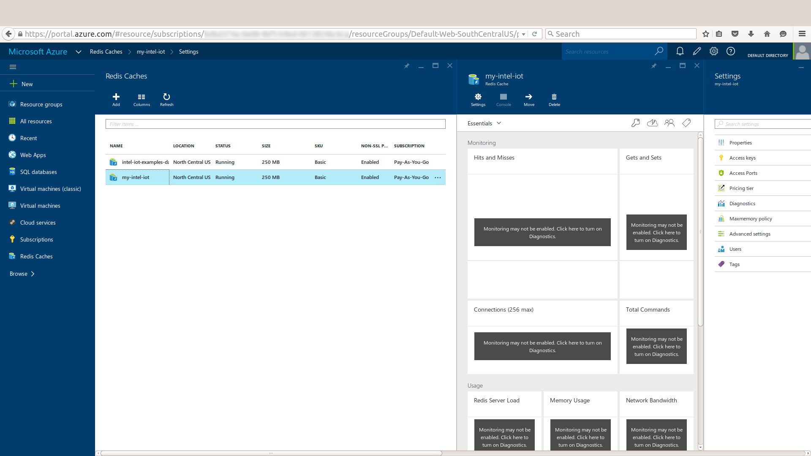
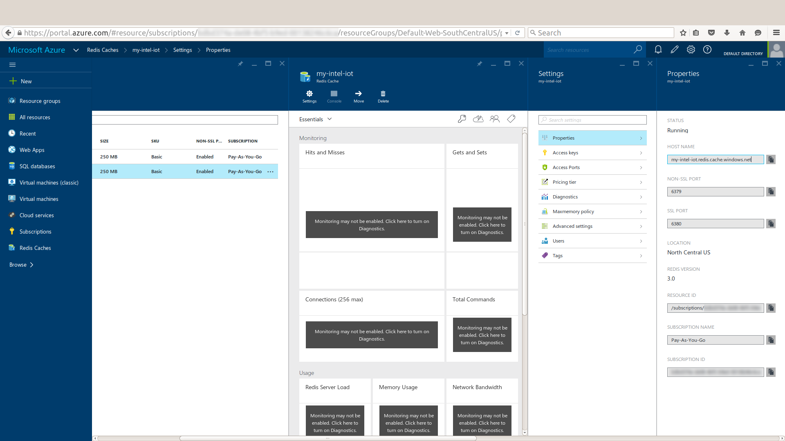
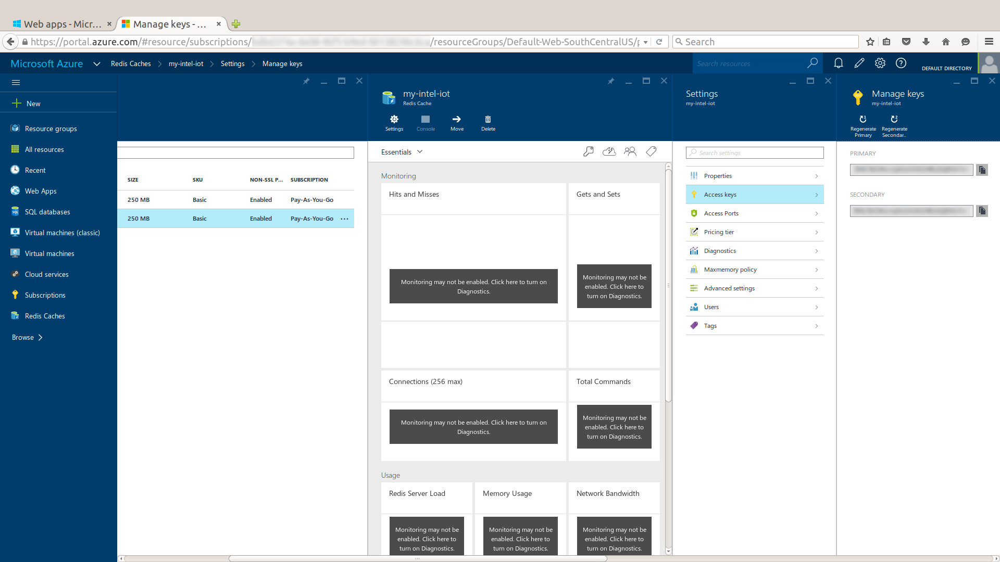
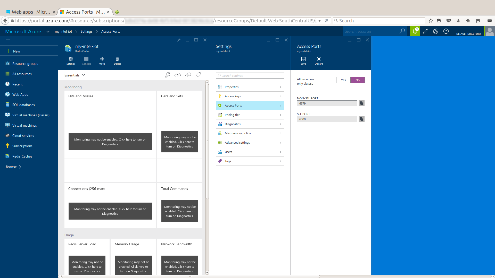
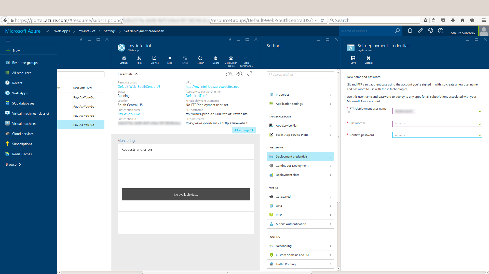

# Intel IoT Examples Datastore

## Introduction

The Intel IoT Examples Datastore is intended to provide a simple data store for sample applications that are part of the Intel IoT Starter Kit examples.

It is a Node.js* application written using Express* ([https://github.com/strongloop/express](https://github.com/strongloop/express)). It uses a Redis* ([http://redis.io](http://redis.io)) data store.

Although this data storage application is developed to deploy on Microsoft* Azure\*, IBM\* Bluemix\*, or Amazon Web Services* (AWS) Elastic Beanstalk*, since it is based on commonly used open-source modules, it should be easy to deploy on many different cloud hosts.

## How it works

The Intel IoT Examples Datastore application provides a simple REST API that allows authorized callers to store either log data or incremental counter data.

It exposes two sets of routes, both using basic token authentication.

To authorize, provide the `AUTH_TOKEN` you set in the `X-Auth-Token` HTTP header.

Multiple clients can share the same Intel IoT Examples Datastore by simply using a different route key for each application.

### Counter

The counter routes are used to increment an increasing counter.

- `GET /counter/:key` - gets the current value of a counter
- `GET /counter/:key/inc` - increments a counter by 1

### Logger

The logger routes wrap Redis* lists, and are used to keep a linear backlog of values.

- `GET /logger/:key` - gets the latest value of a log
- `PUT /logger/:key` - adds a value to a log (`value` parameter in the POST body)
- `GET /logger/:key/all` - returns all values of a log

## Local setup

To install the application dependencies, use the following command:

    $ npm install

You also need to have Redis* installed.
For more information, see the Redis* download page:

<a href="http://redis.io/download">http://redis.io/download</a>

## Configuration

Primary configuration for the application takes the form of the following `ENV` variables:

- `REDIS_URL` - the URL to use for Redis* communication
- `REDIS_AUTH` - authentication token for the Redis* backend
- `PORT` - port to serve the application on (defaults to `3000`)
- `AUTH_TOKEN` - authentication token for clients to use

## Deployment - Microsoft* Azure*

This guide covers setting up a deployment environment for the Intel IoT Examples Datastore on Microsoft* Azure*.

For other platforms, refer to the platform documentation.

Before we begin, ensure you have a Microsoft* Azure* account:

[https://portal.azure.com/signin/index](https://portal.azure.com/signin/index)

### Create a new web application

1. Click **New** and select **Web + Mobile > Web App**. 

2. Enter the name for your new web application.
3. Click **Create**. 
Your new web application is created.

### Create a new Redis* cache

1. Click **New** and select **Data + Storage > Redis Cache**. 

2. Enter the name for your new Redis* cache.
3. Click **Create**. 
Your new Redis* cache is created.

### Determine settings for Redis*

1. In the left sidebar, select **Redis Caches** and click the name of the new Redis* cache you created in the previous step. 

2. Select **All settings > Properties**. 

3. Write down or copy the value in the **HOST NAME** field so you can use it for the `REDIS_URL` setting for the web application.
4. Select **All settings > Access keys**. 

5. Write down or copy the value in the **PRIMARY** or **SECONDARY** field so you can use it for the `REDIS_AUTH` setting for the web application.
6. Select **All settings > Access Ports**. 

7. Set the **Allow access only via SSL** option to **No**.
8. Click **Save**.

### Configure the web application

1. In the left sidebar, select **Web Apps** and click the name of the new web application you previously created. 

2. Select **All settings > Application settings**. 

3. Scroll down to the **App settings** section.
4. Specify `REDIS_URL` by typing the value from the **HOST NAME** field above.
5. Specify `REDIS_AUTH` by typing the value from the **PRIMARY** field above.
6. Specify `AUTH_TOKEN` by typing whatever shared secret key you want.
7. Click **Save**.

Note: you don't need to set `PORT`, as the Microsoft* Azure* platform does that automatically.

### Deploy the web application

1. In the left sidebar, select **Web Apps** and click the name of the new web application you previously created. 

2. Select **All settings > Continuous Deployment**.
3. Select **Choose Source > Local Git Repository**.
4. Click **Save**.
5. Select **All settings > Deployment credentials**.
6. Specify **FTP/deployment user name** and **Password**.
7. Click **Save**.
8. Select **All settings > Properties**.
9. Scroll down to the **Git URL** field and copy its contents.
10. In the directory you're using for this repository, use the command line to run the following Git* command that adds a Microsoft* Azure* server for deployment:

        git remote add azure <GitURL>

where `<gitURL>` is the value you obtained from the **Git URL** field on the **Properties** page.

Now you are ready to deploy the application. Run the following Git* command:

    git push azure master

You are prompted for the password you entered under **Deployment credentials**.

You should see output that ends like this:

    ...
    remote: Finished successfully.
    remote: Deployment successful.
    To https://username@my-intel-iot.scm.azurewebsites.net:443/my-intel-iot.git
      * [new branch]      master -> master

This means your application has been deployed to the Microsoft* Azure* cloud.

## Deployment - IBM* Bluemix*

This guide covers setting up a deployment environment for the Intel IoT Examples Datastore on IBM* Bluemix*.

For other platforms, refer to the platform documentation.

Before we begin, please ensure you have an IBM* Bluemix* account:

[https://console.ng.bluemix.net/home/auth/bluemix](https://console.ng.bluemix.net/home/auth/bluemix)

### Create a new web application

1. Choose the **Space** where you want to add a new web application, or create a new one. 

2. Click **Create App**.
3. Under **What kind of app are you creating?**, click **Web**. 

4. Under **How do you want to get started?**, click **SDK for Node.js™**. 

5. Click **Continue**. 

6. Under **What do you want to name your new app?**, type a new name. 

7. Click **Finish**. 
After a few moments, your new web application is created. 

Click the **Back to Dashboard** link. You can see your new web application listed there.

### Create a new Redis* cache

1. Under **Applications**, click the new application you created in the previous series of steps. 

2. You are taken to the application **Overview** page. Click **Add a service or API**. 

3. Under **Data and Analytics**, click **Redis Cloud**. 

4. Select a plan. 

5. Click **Create**.
6. You may be prompted to restage your application. If so, click **Restage**. 

### Configure the web application

1. Click the **Overview** link to return to the **Overview** page for the new web application. 

2. Click the **Add Git** link at the top right of the **Overview** page. 

3. The **Create Git Repository** dialog box is displayed. Make sure the **Populate the repo with the starter app package and enable the Build & Deploy pipeline** check box is selected.
4. Click **Continue**. 
5. In the **Success!** message box, click **Close**. 

6. URL to the new Git* repository is displayed at the top right of the **Overview** page. 

### Configure Git*

In the directory you're using for this repository, use the command line to run the following Git* command that adds an IBM* Bluemix* server for deployment:

    git remote add bluemix <GitURL>

where `<GitURL>` is the value displayed at the top right of the **Overview** page.

Now you are ready to deploy the application.

### Deploy the web application

To deploy your web application, run the following Git* command:

    git push bluemix master -f

You are prompted for your IBM* Bluemix* username and password.

Once the operation is complete, your application has been deployed to the IBM* Bluemix* cloud.

Note: it may take a moment for your web application to restart.

## Deployment - AWS* Elastic Beanstalk*

This guide covers setting up a deployment environment for the Intel IoT Examples Datastore on AWS* using Elastic Beanstalk*.

For other platforms, refer to the platform documentation.

Before we begin, please ensure you have an AWS* account:

[http://aws.amazon.com/](http://aws.amazon.com/)

### Install the AWS* Elastic Beanstalk Command Line Interface (EB CLI*) tools

To deploy the Intel IoT Examples Datastore on AWS* using Elastic Beanstalk*, you must first install the EB CLI\* tools as explained below:

[http://docs.aws.amazon.com/elasticbeanstalk/latest/dg/eb-cli3-install.html](http://docs.aws.amazon.com/elasticbeanstalk/latest/dg/eb-cli3-install.html)

### Create a new web application

In the directory you're using for this repository, use the command line to run the following EB CLI* command that creates a new AWS* application:

    eb init

When prompted for the Elastic Beanstalk* region, enter the number of the region you wish, or choose the default.

When prompted for the Elastic Beanstalk* application to use, enter the number corresponding to the  **Create new Application** option.

When prompted, enter **y** if you want to set up an SSH connection to your instances. Enter **n** if you do not want to set up an SSH connection.

### Deploy your web application

Now, you can create your running environment by entering the following command:

    eb create

When prompted for the Elastic Beanstalk* environment name, enter the name of the environment. If you want to accept the default, press **Enter**.

When prompted for a CNAME prefix, enter the CNAME prefix you want to use. If you want to accept the default, press **Enter**.

### Configure your web application

Most of the configuration settings are automatically determined by the Intel IoT Examples Datastore application itself when running under AWS* Elastic Beanstalk*. To set `AUTH_TOKEN`, enter the following command:

    eb setenv AUTH_TOKEN=<your token>

where `<your token>` is your actual authorization token.
